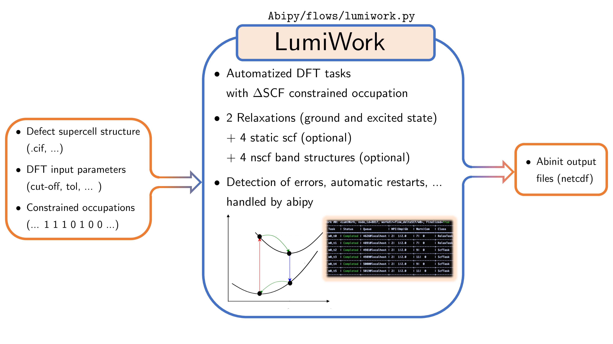
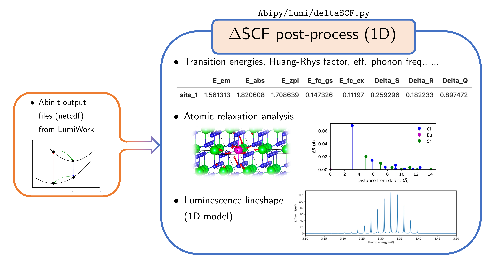
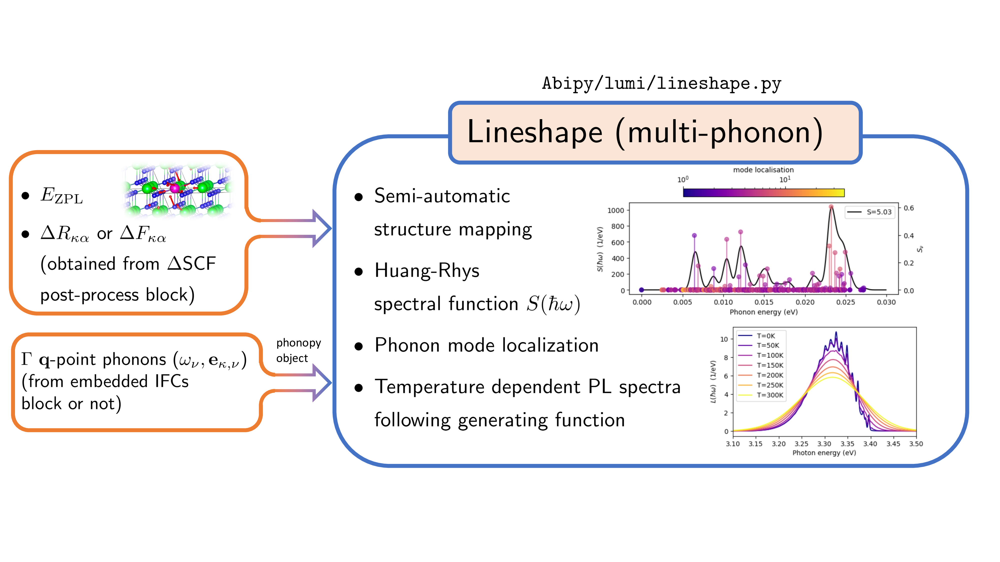
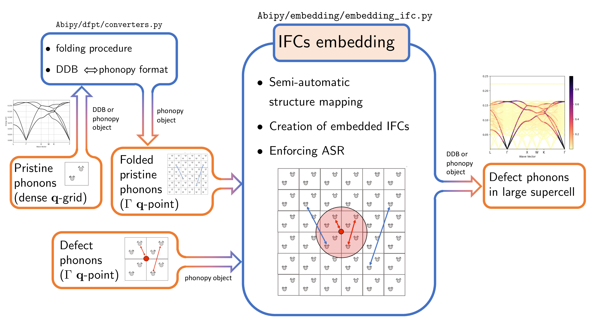

# Lumabi: Luminescence Lineshape of Point Defects

```{figure} ../paper/Lumabi_logo.png
---
height: 200px
---
```
These chapters introduces **Lumabi**, a collection of Python modules integrated in the [AbiPy](https://github.com/abinit/abipy)
framework designed to compute the luminescence lineshape of point defects in solids using [Abinit](https://www.abinit.org/).

## Overview

Lumabi is structured around four main Python modules, each automating a key stage of the computational workflow
for phonon-resolved luminescence spectra of defects.
These modules are designed to be used together, the output of one module serving as input for another, or separately.

### 1. LumiWork Module



The LumiWork module automates ABINIT DFT tasks with $\Delta$SCF constrained occupations.
It manages two structural relaxations (ground-state and excite-state), and optional static SCF and NSCF band structure calculations.
The main results are stored in netcdf files, ready for post-processing.

### 2. $\Delta$SCF Post-Processing Module



This module processes the netcdf output files produced by LumiWork, and analyze them with a one-dimensional configuration coordinate model (1D-CCM).
It computes transition energies, Huang-Rhys factors, effective phonon frequencies, lineshapes within the 1D-CCM, and helps analyze atomic relaxations.

### 3. Lineshape Calculation Module



Here, we adopt a multi-phonon approach, or multi-dimensional configuration coordinate model (multi-D CCM).
The Lineshape module computes the Huang-Rhys spectral function and generates (temperature-dependent) photoluminescence spectra
using the generating function approach.
It takes in input the zero-phonon line energy, atomic displacements or forces, and phonon modes
(potentially from the IFCs embedding module), and produces the final phonon-resolved luminescence spectrum.

### 4. IFCs Embedding Module



The IFCs Embedding module enables the calculation of defect phonons in large supercells by combining interatomic force constants (IFCs)
from both pristine and defect systems.
This approach is useful to capture both the coupling with long-wavelength and localized phonon modes.

## Tutorial structure

This tutorial is organized as follows:

1. [**Theory**](../theory/lesson_theory.md): Presents the formalism for luminescence lineshape calculations,
   from Fermi's golden rule to practical models for solids, and introduces the Huang-Rhys theory and generating function approach.
   It then discusses some aspects of the computational methodology, including the $\Delta$SCF, the use of the forces instead
   of displacements, and the IFCs embedding approach.
2. [**LumiWork Workflow**](../lumiwork/lesson_lumiwork.md): Guides through setting up and running the automated workflow
   for $\Delta$SCF calculations using the `lumiwork` module.
3. [**$\Delta$SCF Post-Processing (1D)**](../post_process_1D/lesson_post_process_1D.md): Shows how to analyze results
   of a LumiWork workflow using the 1D-CCM (single effective phonon mode model) with the `deltaSCF` module.
4. [**Lineshape (multi-phonon)**](../lineshape/lesson_multi_phonons.md): Explains how to compute with the `lineshape` module
   the phonon-resolved luminescence spectrum using the generating function approach.
5. [**IFC Embedding**](../ifc_emb/lesson_ifc_emb.md): Details the embedding approach of the `embedding_ifc` module
   for obtaining phonon modes in large supercells with defects.
