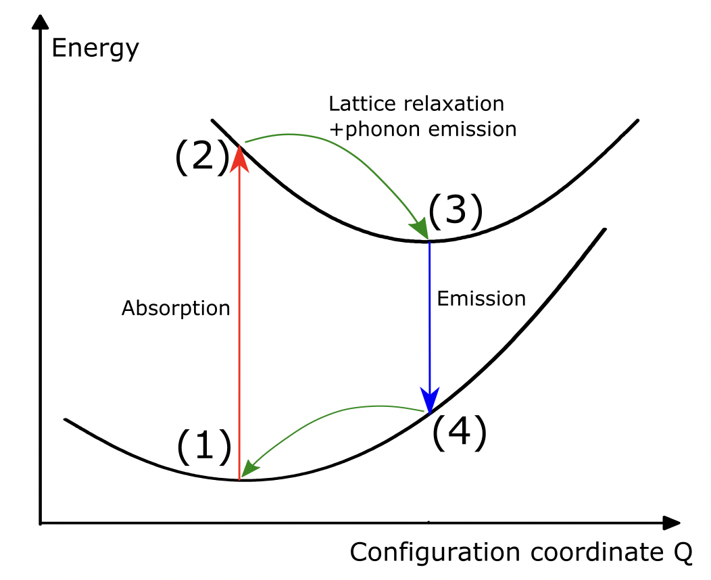

---
jupytext:
  text_representation:
    extension: .md
    format_name: myst
    format_version: 0.13
    jupytext_version: 1.10.3
kernelspec:
  display_name: Python 3
  language: python
  name: python3
---

# $\Delta$SCF constrained-occupations with Abinit and AbiPy

This tutorial aims to show how to perform $\Delta$SCF constrained-occupations computations with Abinit in an automated way. 

```{warning}
Before starting, it is recommended to first get familiar with the [theory section](../theory/lesson_theory.md) and the [AbiPy environment](https://abinit.github.io/abipy_book/intro.html), in particular the working principle of [AbiPy workflows](https://abinit.github.io/abipy_book/flows.html).
```

The theory and equations associated to this tutorial can be found in the related [theory section](../theory/lesson_theory.md), and references therein. 

```{note}
The examples shown in these tutorials are based on a certain type of defect (Eu substitution), but the $\Delta$SCF constrained-occupations methodology is general and can be applied to numerous kind of defects.  
```

## Recap 

Our goal is to compute the photo-luminescent properties of an impurity embedded in a lattice. Here we will take the example of the red phosphor material Sr[Li$_2$Al$_2$O$_2$N$_2$]:Eu$^{2+}$ (nicknamed SALON). 

We need to compute the four states (energies and structures) highlighted in the figure below :

1. Relaxed ground state (A$_g$)
2. Unrelaxed excited state (A$_{e}^{*}$)
3. Relaxed excited state (A$_{e}$)
4. Unrelaxed ground state (A$_{g}^{*}$)

 

This requires two relaxations (one in the ground and excited state) and four static scf computations (at each state). One could eventually add four nscf computations for the electronic band structures. These 6 (+4) computations are what is automatized in one "LumiWork".

The exicted state configuration is computed following the 
SCF-constrained occupation method, where the first unoccupied state of the ground state is force to be occupied in the excited state. On Abinit, the variable "occ" reads like :

* ground state  : occ ... 1 1 1 0 0 0 0 ...

* excited state : occ ... 1 1 0 1 0 0 0 ...


```{note}
The example shown in this tutorial is designed to run in a few minutes on a laptop, meaning that the results are  unconverged (supercell size, different DFT parameters,...). Results of production runs for this kind of system can be found in references {cite}`bouquiaux2021importance` and {cite}`bouquiaux2023first`
```

## LumiWork Workflow

The creation of one LumiWork is done with the class method from_scf_inputs() :

```{code-cell}
from abipy.flowtk.lumi_works import LumiWork
help(LumiWork.from_scf_inputs)
```

This class method is a container that receives mainly Abinit Input objects and dictionnaries of Abinit variables. The lumi_works.py script will then use these informations to do the following tasks:

1. Launch a first structural relaxation in the ground state (task t0), save the ground-state relaxed structure.
2. Use the previous structure as the starting point for a second structural relaxation in the excited state (task t1), save the excited-state relaxed  structure.
3. Launch the four static scf tasks simultaneously (tasks t2,t3,t4 and t5 in the order shown in the recap section)
4. Launch optionnaly the four NSCF tasks (tasks t6,t7,t8 and t9 in the same order)
5. Perform a first quick post-process and store the results in flow_deltaSCF/w0/outdata/Delta_SCF.json .

## Creating a LumiWork


```{note}
The complete workflow was ran separately, before building this jupyter book. You will find the worflow scripts and corresponding folder in the [github of this book](https://github.com/jbouquiaux/lumi_book/tree/main/lumi_book/lumi)
```

A LumiWork (or a serie of LumiWork's) can be created with the run_deltaSCF.py script, as shown below :

```python
#!/usr/bin/env python
import sys
import os
import abipy.abilab as abilab
import abipy.flowtk as flowtk
import abipy.data as abidata
from abipy.core import structure

def scf_inp(structure):
    pseudodir='pseudos'
    
    pseudos = ('Eu.xml',
               'Sr.xml',
               'Al.xml',
               'Li.xml',
               'O.xml',
               'N.xml')
    gs_scf_inp = abilab.AbinitInput(structure=structure, pseudos=pseudos,pseudo_dir=pseudodir)
    gs_scf_inp.set_vars(ecut=10,
                        pawecutdg=20,
                        chksymbreak=0,
                        diemac=5,
                        prtwf=-1,
                        nstep=100,
                        toldfe=1e-6,
                        chkprim=0,
                        )

    # Set DFT+U and spinat parameters according to chemical symbols.
    symb2spinat = {"Eu": [0, 0, 7]}
    symb2luj = {"Eu": {"lpawu": 3, "upawu": 7, "jpawu": 0.7}}

    gs_scf_inp.set_usepawu(usepawu=1, symb2luj=symb2luj)
    gs_scf_inp.set_spinat_from_symbols(symb2spinat, default=(0, 0, 0))

    n_val = gs_scf_inp.num_valence_electrons
    n_cond = round(20)

    spin_up_gs = f"\n{int((n_val - 7) / 2)}*1 7*1 {n_cond}*0"
    spin_up_ex = f"\n{int((n_val - 7) / 2)}*1 6*1 0 1 {n_cond - 1}*0" 
    spin_dn = f"\n{int((n_val - 7) / 2)}*1 7*0 {n_cond}*0"

    nsppol = 2
    shiftk = [0, 0, 0]
    ngkpt = [1, 1, 1]

    # Build SCF input for the ground state configuration.
    gs_scf_inp.set_kmesh_nband_and_occ(ngkpt, shiftk, nsppol, [spin_up_gs, spin_dn])
    # Build SCF input for the excited configuration.
    exc_scf_inp = gs_scf_inp.deepcopy()
    exc_scf_inp.set_kmesh_nband_and_occ(ngkpt, shiftk, nsppol, [spin_up_ex, spin_dn])

    return gs_scf_inp,exc_scf_inp


def relax_kwargs():

    # Dictionary with input variables to be added for performing structural relaxations.
    relax_kwargs = dict(
        ecutsm=0.5,
        toldff=1e-4, # TOO HIGH, just for testing purposes.
        tolmxf=1e-3, # TOO HIGH, just for testing purposes.
        ionmov=2,
        dilatmx=1.05,  # Keep this also for optcell 0 else relaxation goes bananas due to low ecut.
        chkdilatmx=0,
    )

    relax_kwargs_gs=relax_kwargs.copy()
    relax_kwargs_gs['optcell']=0 # in the ground state, if allow relaxation of the cell (optcell 2)

    relax_kwargs_ex=relax_kwargs.copy()
    relax_kwargs_ex['optcell']=0 # in the excited state, no relaxation of the cell

    return relax_kwargs_gs, relax_kwargs_ex


def build_flow(options):

    # Working directory (default is the name of the script with '.py' removed and "run_" replaced by "flow_")
    if not options.workdir:
        options.workdir = os.path.basename(sys.argv[0]).replace(".py", "").replace("run_", "flow_")

    flow = flowtk.Flow(options.workdir, manager=options.manager)

    #Construct the structures
    prim_structure=structure.Structure.from_file('SALON_prim.cif')
    structure_list=prim_structure.make_doped_supercells([1,1,2],'Sr','Eu')

    ####### Delta SCF part of the flow #######
    
    from abipy.flowtk.lumi_works import LumiWork
    
    for stru in structure_list:
       gs_scf_inp, exc_scf_inp = scf_inp(stru)
       relax_kwargs_gs, relax_kwargs_ex = relax_kwargs()
       Lumi_work=LumiWork.from_scf_inputs(gs_scf_inp, exc_scf_inp, relax_kwargs_gs, relax_kwargs_ex,ndivsm=0)
       flow.register_work(Lumi_work)
 
    return flow


@flowtk.flow_main

def main(options):
    """
    This is our main function that will be invoked by the script.
    flow_main is a decorator implementing the command line interface.
    Command line args are stored in `options`.
    """
    return build_flow(options)


if __name__ == '__main__':
    sys.exit(main())
```

Let's decompose this script.\
We first create the abinit input objects. This is achieved by the function `def scf_inp(structure):` that takes as argument a structure object. It returns abinit input objects for the ground and excited state. It is in this function that all the important abinit variables that are specific to the system under study are located. The tricky part is the automatic definition of the occupation number, this is achieved by : 


```python
    n_val = gs_scf_inp.num_valence_electrons
    n_cond = round(20)  # to be choosen by user
     
    #### SPECIFIC to Eu doped!!!! ######
    spin_up_gs = f"\n{int((n_val - 7) / 2)}*1 7*1 {n_cond}*0"  # ground state occ for spin up
    spin_up_ex = f"\n{int((n_val - 7) / 2)}*1 6*1 0 1 {n_cond - 1}*0" # exicted state occ for spin up
    spin_dn = f"\n{int((n_val - 7) / 2)}*1 7*0 {n_cond}*0" # ground/excited state occ for spin down
    ####################################

    nsppol = 2
    shiftk = [0, 0, 0]
    ngkpt = [1, 1, 1]

    # Build SCF input for the ground state configuration.
    gs_scf_inp.set_kmesh_nband_and_occ(ngkpt, shiftk, nsppol, [spin_up_gs, spin_dn])
    # Build SCF input for the excited configuration.
    exc_scf_inp = gs_scf_inp.deepcopy()
    exc_scf_inp.set_kmesh_nband_and_occ(ngkpt, shiftk, nsppol, [spin_up_ex, spin_dn])
```

```{warning}
These occupations are specific to Eu$^{2+}$ doped system (seven 4f electrons)!
```

The relaxation parameters (that might be different between ground and excited state!) are given in the function `def relax_kwargs():`.
Finally, we are now able to create the workflow with :

```python
def build_flow(options):

    # Working directory (default is the name of the script with '.py' removed and "run_" replaced by "flow_")
    if not options.workdir:
        options.workdir = os.path.basename(sys.argv[0]).replace(".py", "").replace("run_", "flow_")

    flow = flowtk.Flow(options.workdir, manager=options.manager)

    #Construct the structures
    prim_structure=structure.Structure.from_file('SALON_prim.cif')
    structure_list=prim_structure.make_doped_supercells([1,1,2],'Sr','Eu')

    ####### Delta SCF part of the flow #######
    
    from abipy.flowtk.lumi_works import LumiWork
    
    for stru in structure_list: ## loop through all the non-equivalent sites available for Eu. 
       gs_scf_inp, exc_scf_inp = scf_inp(stru)
       relax_kwargs_gs, relax_kwargs_ex = relax_kwargs()
       Lumi_work=LumiWork.from_scf_inputs(gs_scf_inp, exc_scf_inp, relax_kwargs_gs, relax_kwargs_ex,ndivsm=0)
       flow.register_work(Lumi_work)
 
    return flow 
```
Where we have use the convenient `make_doped_supercells()` method.

```{code-cell}
from abipy.core.structure import Structure
help(Structure.make_doped_supercells)
```

## Running a LumiWork
Let us run see what running the code in practice looks like. In your terminal, create the worfklow with
```command
python run_deltaSCF.py
```
A new /flow_deltaSCF folder should be created. 
We observe that at this time, only one taks is created in  /flow_deltaSCF/w0/t0, the first ground state relaxation. This is normal since the rest of the workflow will be created at run-time, when the ground state relaxed structure will be extracted.
We launch the flow with the command :

```command
nohup abirun.py flow_deltaSCF scheduler > log 2> err &
```
After completion, you can verify the status of the flow with 

```command
abirun.py flow_deltaSCF status
```
 

A first quick post-proccessing of the results (following a 1D-CCM, see [next section](...)) can be found in /flow_deltaSCF/w0/Delta_SCF.json file. 

## Relaxations only?  

In some cases, it might be interesting to perform the two relaxation only, or the 4 static computations only. This flexibility is allowed thanks to the `LumiWork_relaxations()` class
```{code-cell}
from abipy.flowtk.lumi_works import LumiWork_relaxations
print(LumiWork_relaxations.__doc__)
help(LumiWork_relaxations.from_scf_inputs)
```
and with the `LumiWorkFromRelax` class
```{code-cell}
from abipy.flowtk.lumi_works import LumiWorkFromRelax
print(LumiWorkFromRelax.__doc__)
help(LumiWorkFromRelax.from_scf_inputs)
```
Running only one computation is also feasible by changing the end of the run_DeltaSCF.py script. For example, if you only need the ground state relaxation, you might use `LumiWork_relaxations.from_scf_inputs()` and register only the first task : 

```python
Lumi_work=LumiWork_relaxations.from_scf_inputs(gs_scf_inp, exc_scf_inp, relax_kwargs_gs, relax_kwargs_ex,ndivsm=0)
flow.register_task(Lumi_work[0]) # notice the register_task and not register_work
```