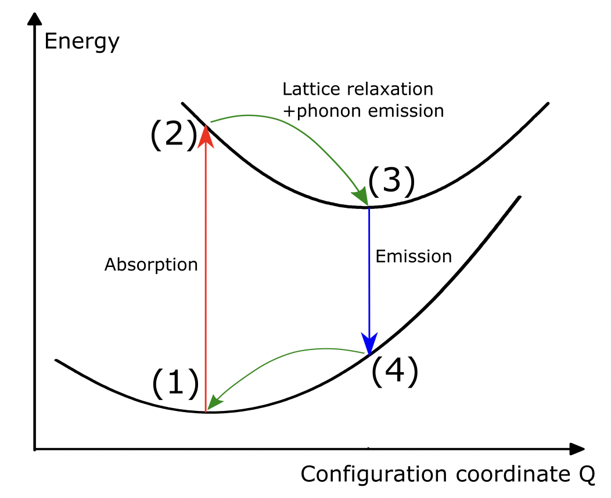
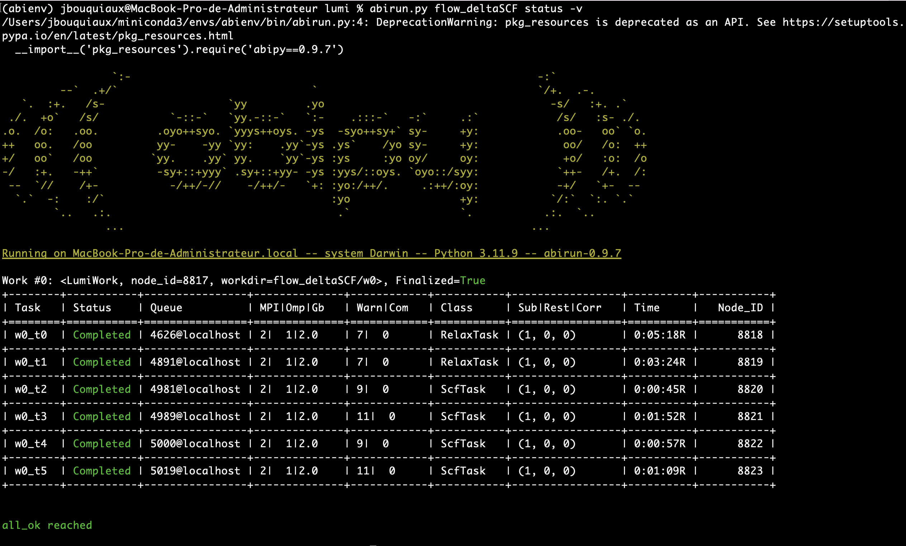

---
jupytext:
  text_representation:
    extension: .md
    format_name: myst
    format_version: 0.13
    jupytext_version: 1.10.3
kernelspec:
  display_name: Python 3
  language: python
  name: python3
---

# LumiWork Workflow

This tutorial shows how to perform $\Delta$SCF constrained-occupation calculations with Abinit in an automated way.
The theory and equations associated with this tutorial can be found in the related [theory section](../theory/lesson_theory.md) and in the references therein.

```{note}
Before starting, we recommend getting familiar with the [AbiPy environment](https://abinit.github.io/abipy_book/intro.html),
in particular with the working principles of [AbiPy workflows](https://abinit.github.io/abipy_book/flows.html).
```

```{note}
The examples shown in these tutorials are based on a specific type of defect (Eu substitution),
but the $\Delta$SCF constrained-occupation methodology can be applied to many kinds of defects.
```

## Recap

Our goal is to compute the photoluminescence properties of an impurity embedded in a lattice.
Here we take the example of the red phosphor Sr[Li$_2$Al$_2$O$_2$N$_2$]:Eu$^{2+}$.

We need to compute the four states (energies and structures) highlighted in the figure below:

1. Relaxed ground state (A$_g$)
2. Unrelaxed excited state (A$_{e}^{*}$)
3. Relaxed excited state (A$_{e}$)
4. Unrelaxed ground state (A$_{g}^{*}$)



This requires two relaxations (one in the ground state and one in the excited state) and four static SCF calculations (one for each state).
Optionally, one can add four NSCF calculations for the electronic band structures.
These 6 (+4) calculations are what is automated in one "LumiWork".

The excited-state configuration is computed with the $\Delta$SCF constrained-occupation method.

A key challenge in $\Delta$SCF calculations is setting up the occupation numbers correctly for both the ground and excited states.

### General Principles

For a spin-polarized calculation (`nsppol=2`), you need to specify the occupations separately for the spin-up and spin-down channels with the `occ` input variable in Abinit.

For instance, for the ground state, it might read:
```
N_occ_el_up*1  N_empty_el_up*0
N_occ_el_dn*1  N_empty_el_dn*0
```
where `N_occ_el_up` and `N_occ_el_dn` are the numbers of occupied bands in the spin-up and spin-down channels, respectively, and `N_empty_el_up` and `N_empty_el_dn` are the numbers of empty (conduction) bands.

For the excited state, we can create a "hole" in the highest occupied state and promote one electron to the lowest unoccupied state:

```
(N_occ_el_up-1)*1  0  1  (N_empty_el_up-1)*0
N_occ_el_dn*1  N_empty_el_dn*0

```

This pattern needs to be adapted depending on:

1. The total number of valence electrons in your system
2. The electronic configuration of your defect
3. The type of excitation (e.g., d-d, f-d, spin-flip)

## LumiWork Workflow

```{note}
The example shown in this tutorial is designed to run in a few minutes on a laptop, which means that the results
are not converged (supercell size, DFT parameters, ...).
Results of production runs for this kind of system can be found in references {cite}`bouquiaux2021importance` and {cite}`bouquiaux2023first`.
```

A LumiWork is created with the `from_scf_inputs()` class method:

```{code-cell}
from abipy.flowtk.lumi_works import LumiWork
help(LumiWork.from_scf_inputs)
```

This class method mainly receives `AbinitInput` objects and dictionaries of Abinit variables.
The `lumi_works.py` module then uses this information to perform the following tasks:

1. Launch a first structural relaxation in the ground state (task t0) and save the relaxed ground-state structure.
2. Use the previous structure as the starting point for a second structural relaxation in the excited state (task t1),
   and save the relaxed excited-state structure.
3. Launch the four static SCF tasks simultaneously (tasks t2, t3, t4 and t5, in the order shown in the recap section).
4. Optionally, launch the four NSCF tasks (tasks t6, t7, t8 and t9, in the same order).
5. Perform a first quick post-processing and store the results in `flow_deltaSCF/w0/outdata/Delta_SCF.json`.

## Creating a LumiWork

```{note}
The complete workflow was run separately, before building this Jupyter Book.
You will find the workflow scripts and the corresponding folder [here](https://github.com/abinit/abipy_book/tree/master/abipy_book).
```

A LumiWork (or a series of LumiWorks) can be created with the `run_deltaSCF.py` script, as shown below:

```python
#!/usr/bin/env python
import sys
import os
import abipy.abilab as abilab
import abipy.flowtk as flowtk
import abipy.data as abidata
from abipy.core import structure

def scf_inp(structure):
    pseudodir = 'pseudos'

    pseudos = ('Eu.xml',
               'Sr.xml',
               'Al.xml',
               'Li.xml',
               'O.xml',
               'N.xml')

    gs_scf_inp = abilab.AbinitInput(structure=structure, pseudos=pseudos, pseudo_dir=pseudodir)
    gs_scf_inp.set_vars(ecut=10,
                        pawecutdg=20,
                        chksymbreak=0,
                        diemac=5,
                        prtwf=-1,
                        nstep=100,
                        toldfe=1e-6,
                        chkprim=0,
                        )

    # Set DFT+U and spinat parameters according to chemical symbols.
    symb2spinat = {"Eu": [0, 0, 7]}
    symb2luj = {"Eu": {"lpawu": 3, "upawu": 7, "jpawu": 0.7}}

    gs_scf_inp.set_usepawu(usepawu=1, symb2luj=symb2luj)
    gs_scf_inp.set_spinat_from_symbols(symb2spinat, default=(0, 0, 0))

    n_val = gs_scf_inp.num_valence_electrons
    n_cond = round(20)

    spin_up_gs = f"\n{int((n_val - 7) / 2)}*1 7*1 {n_cond}*0"
    spin_up_ex = f"\n{int((n_val - 7) / 2)}*1 6*1 0 1 {n_cond - 1}*0"
    spin_dn = f"\n{int((n_val - 7) / 2)}*1 7*0 {n_cond}*0"

    nsppol = 2
    shiftk = [0, 0, 0]
    ngkpt = [1, 1, 1]

    # Build SCF input for the ground state configuration.
    gs_scf_inp.set_kmesh_nband_and_occ(ngkpt, shiftk, nsppol, [spin_up_gs, spin_dn])

    # Build SCF input for the excited configuration.
    exc_scf_inp = gs_scf_inp.deepcopy()
    exc_scf_inp.set_kmesh_nband_and_occ(ngkpt, shiftk, nsppol, [spin_up_ex, spin_dn])

    return gs_scf_inp,exc_scf_inp


def relax_kwargs():

    # Dictionary with input variables to be added for performing structural relaxations.
    relax_kwargs = dict(
        ecutsm=0.5,
        toldff=1e-4, # TOO HIGH, just for testing purposes.
        tolmxf=1e-3, # TOO HIGH, just for testing purposes.
        ionmov=2,
        dilatmx=1.05,  # Keep this also for optcell 0 else relaxation goes bananas due to low ecut.
        chkdilatmx=0,
    )

    relax_kwargs_gs=relax_kwargs.copy()
    relax_kwargs_gs['optcell'] = 0 # in the ground state, if allow relaxation of the cell (optcell 2)

    relax_kwargs_ex=relax_kwargs.copy()
    relax_kwargs_ex['optcell'] = 0 # in the excited state, no relaxation of the cell

    return relax_kwargs_gs, relax_kwargs_ex


def build_flow(options):

    # Working directory (default is the name of the script with '.py' removed and "run_" replaced by "flow_")
    if not options.workdir:
        options.workdir = os.path.basename(sys.argv[0]).replace(".py", "").replace("run_", "flow_")

    flow = flowtk.Flow(options.workdir, manager=options.manager)

    # Construct the structures
    prim_structure = structure.Structure.from_file('SALON_prim.cif')
    structure_list = prim_structure.make_doped_supercells([1,1,2], 'Sr', 'Eu')

    ####### Delta SCF part of the flow #######

    from abipy.flowtk.lumi_works import LumiWork

    for stru in structure_list:
       gs_scf_inp, exc_scf_inp = scf_inp(stru)
       relax_kwargs_gs, relax_kwargs_ex = relax_kwargs()
       Lumi_work = LumiWork.from_scf_inputs(gs_scf_inp, exc_scf_inp, relax_kwargs_gs, relax_kwargs_ex,ndivsm=0)
       flow.register_work(Lumi_work)

    return flow


@flowtk.flow_main
def main(options):
    """
    This is our main function that will be invoked by the script.
    flow_main is a decorator implementing the command line interface.
    Command line args are stored in `options`.
    """
    return build_flow(options)


if __name__ == '__main__':
    sys.exit(main())
```

Let's break this script down.

We first create the Abinit input objects.
This is done by the `scf_inp(structure)` function, which takes a structure object as argument
and returns the Abinit input objects for the ground and excited states.
This function contains all the important Abinit variables that are specific to the system under study.
The tricky part is the automatic definition of the occupation numbers. Let's go through the Eu$^{2+}$ example step by step:

```python
    n_val = gs_scf_inp.num_valence_electrons  # Total valence electrons in the supercell
    n_cond = round(20)  # Number of conduction bands to include (user choice)

    #### SPECIFIC to Eu2+ doped system (7 electrons in 4f shell) ####
    spin_up_gs = f"\n{int((n_val - 7) / 2)}*1 7*1 {n_cond}*0"
    spin_up_ex = f"\n{int((n_val - 7) / 2)}*1 6*1 0 1 {n_cond - 1}*0"
    spin_dn = f"\n{int((n_val - 7) / 2)}*1 7*0 {n_cond}*0"
    ####################################################################

    nsppol = 2
    shiftk = [0, 0, 0]
    ngkpt = [1, 1, 1]

    # Build SCF input for the ground state configuration.
    gs_scf_inp.set_kmesh_nband_and_occ(ngkpt, shiftk, nsppol, [spin_up_gs, spin_dn])

    # Build SCF input for the excited configuration.
    exc_scf_inp = gs_scf_inp.deepcopy()
    exc_scf_inp.set_kmesh_nband_and_occ(ngkpt, shiftk, nsppol, [spin_up_ex, spin_dn])
```

```{note}
Eu$^{2+}$ has the electronic configuration [Xe]4f$^7$5d$^0$. In the ground state, the seven 4f electrons are all spin-up (due to Hund's rules).
The excited state corresponds to a 4f$\rightarrow$5d transition: one 4f electron is promoted to the 5d shell.

Let's break down the occupation strings:

**`spin_up_gs`**: Ground state, spin-up channel

- `{int((n_val - 7) / 2)}*1`: All "normal" valence electrons (excluding Eu 4f) $\rightarrow$ fully occupied
- `7*1`: The seven 4f electrons of Eu$^{2+}$ $\rightarrow$ fully occupied
- `{n_cond}*0`: Empty conduction bands

**`spin_up_ex`**: Excited state, spin-up channel

- `{int((n_val - 7) / 2)}*1`: All "normal" valence electrons $\rightarrow$ still fully occupied
- `6*1`: Only six 4f electrons remain $\rightarrow$ occupied
- `0`: One empty 4f state (the "hole")
- `1`: One electron promoted to 5d $\rightarrow$ occupied
- `{n_cond - 1}*0`: Remaining conduction bands empty

**`spin_dn`**: Spin-down channel (identical for ground and excited states)

- `{int((n_val - 7) / 2)}*1`: All "normal" valence electrons $\rightarrow$ occupied
- `7*0`: No spin-down 4f electrons
- `{n_cond}*0`: Empty conduction bands

**Why $(n_{val} - 7) / 2$?**

This counts all the valence electrons *except* the 7 Eu 4f electrons. We divide by 2 because, in the spin-polarized calculation,
these "normal" electrons are equally distributed between the spin-up and spin-down channels.

A further example is presented for a spin-flip transition at the end of this page.
```

The relaxation parameters (which might differ between the ground and excited states!) are given in the `relax_kwargs()` function.
Finally, we can create the workflow with:

```python
def build_flow(options):

    # Working directory (default is the name of the script with '.py' removed and "run_" replaced by "flow_")
    if not options.workdir:
        options.workdir = os.path.basename(sys.argv[0]).replace(".py", "").replace("run_", "flow_")

    flow = flowtk.Flow(options.workdir, manager=options.manager)

    # Construct the structures
    prim_structure = structure.Structure.from_file('SALON_prim.cif')
    structure_list = prim_structure.make_doped_supercells([1,1,2], 'Sr', 'Eu')

    ####### Delta SCF part of the flow #######

    from abipy.flowtk.lumi_works import LumiWork

    for stru in structure_list: ## loop through all the non-equivalent sites available for Eu.
       gs_scf_inp, exc_scf_inp = scf_inp(stru)
       relax_kwargs_gs, relax_kwargs_ex = relax_kwargs()
       Lumi_work = LumiWork.from_scf_inputs(gs_scf_inp, exc_scf_inp, relax_kwargs_gs, relax_kwargs_ex,ndivsm=0)
       flow.register_work(Lumi_work)

    return flow
```

where we have used the convenient `make_doped_supercells()` method:

```{code-cell}
from abipy.core.structure import Structure
help(Structure.make_doped_supercells)
```

## Running a LumiWork
Let us see what running the code looks like in practice. In your terminal, create the workflow with

```bash
python run_deltaSCF.py
```

A new `flow_deltaSCF` folder should be created.
Note that, at this point, only one task has been created in `flow_deltaSCF/w0/t0`: the first ground-state relaxation.
This is normal, since the rest of the workflow is created at run time, once the relaxed ground-state structure has been extracted.
We launch the flow with the command:

```bash
nohup abirun.py flow_deltaSCF scheduler > log 2> err &
```

After completion, you can check the status of the flow with

```bash
abirun.py flow_deltaSCF status
```



A first quick post-processing of the results (within a 1D-CCM, see the [next section](../post_process_1D/lesson_post_process_1D.md))
can be found in the `flow_deltaSCF/w0/outdata/Delta_SCF.json` file.

## Relaxations only?

In some cases, it might be useful to perform only the two relaxations, or only the four static calculations.
This flexibility is provided by the `LumiWork_relaxations` class

```{code-cell}
from abipy.flowtk.lumi_works import LumiWork_relaxations

print(LumiWork_relaxations.__doc__)
help(LumiWork_relaxations.from_scf_inputs)
```

and with the `LumiWorkFromRelax` class

```{code-cell}
from abipy.flowtk.lumi_works import LumiWorkFromRelax

print(LumiWorkFromRelax.__doc__)
help(LumiWorkFromRelax.from_scf_inputs)
```

Running a single calculation is also possible by changing the end of the `run_deltaSCF.py` script.
For example, if you only need the ground-state relaxation, you can use `LumiWork_relaxations.from_scf_inputs()`
and register only the first task:

```python
Lumi_work = LumiWork_relaxations.from_scf_inputs(gs_scf_inp, exc_scf_inp, relax_kwargs_gs, relax_kwargs_ex,ndivsm=0)

flow.register_task(Lumi_work[0]) # notice the register_task and not register_work
```

## Additional Example: F-center in CaO

### Background

An F-center is a neutral oxygen vacancy with two trapped electrons. Unlike the Eu$^{2+}$ case, where we have a 4f$\rightarrow$5d electron promotion, the F-center excited state results from a **spin-flip** transition: one electron flips from spin-down to spin-up, changing the configuration from singlet to triplet.

**Ground state**: Two electrons with opposite spins in the defect state (singlet, $S=0$)
- Spin-up: 1 electron in defect state
- Spin-down: 1 electron in defect state

**Excited state**: Both electrons have parallel spins (triplet, $S=1$)
- Spin-up: 2 electrons in defect state (one original + one flipped from spin-down)
- Spin-down: 0 electrons in defect state

### Occupation Setup

The key part of the occupation setup for the F-center case:

```python
def scf_inp_fcenter(structure):
    # ... (pseudopotentials, basic parameters)

    n_val = gs_scf_inp.num_valence_electrons
    n_cond = 4  # Number of conduction bands

    # For this example: 60 host valence electrons + 2 defect electrons
    n_host = 60

    #### SPECIFIC to F-center (2 electrons, spin-flip excitation) ####
    # Ground state: singlet configuration (one electron per spin channel)
    spin_up_gs = f"\n{n_host}*1 1 0 {n_cond}*0"  # 60 host + 1 defect electron
    spin_dn_gs = f"\n{n_host}*1 1 0 {n_cond}*0"  # 60 host + 1 defect electron

    # Excited state: triplet configuration (both electrons in spin-up)
    spin_up_ex = f"\n{n_host}*1 1 1 {n_cond-1}*0"  # 60 host + 2 defect electrons
    spin_dn_ex = f"\n{n_host}*1 0 0 {n_cond}*0"    # 60 host + 0 defect electrons
    ####################################################################

    nsppol = 2
    ngkpt = [1, 1, 1]
    shiftk = [0, 0, 0]

    # Build SCF input for ground state
    gs_scf_inp.set_kmesh_nband_and_occ(ngkpt, shiftk, nsppol, [spin_up_gs, spin_dn_gs])

    # Build SCF input for excited state
    exc_scf_inp = gs_scf_inp.deepcopy()
    exc_scf_inp.set_kmesh_nband_and_occ(ngkpt, shiftk, nsppol, [spin_up_ex, spin_dn_ex])

    return gs_scf_inp, exc_scf_inp
```

```{tip}
When adapting this workflow to your own defect system:

1. Identify the total number of valence electrons: `n_val = gs_scf_inp.num_valence_electrons`
2. Determine how many electrons are localized on your defect
3. Understand the nature of the excitation (promotion vs. spin-flip vs. other)
4. Write the appropriate occupation strings for each spin channel
5. Run a small test calculation to confirm that the occupation pattern produces the expected electronic structure
```
