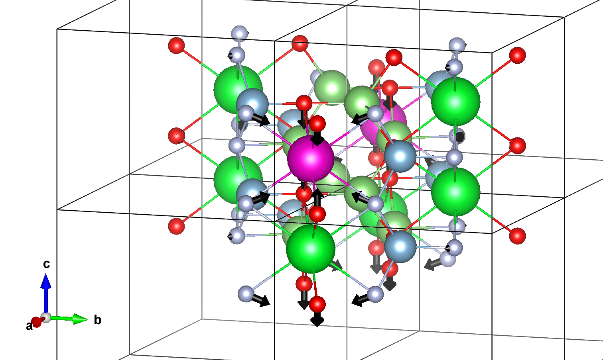

---
jupytext:
  text_representation:
    extension: .md
    format_name: myst
    format_version: 0.13
    jupytext_version: 1.10.3
kernelspec:
  display_name: Python 3
  language: python
  name: python3
---
$\newcommand{\AA}{\unicode{x212B}}$

# $\Delta$SCF Post-Processing (1D)
Now that the LumiWork is complete, it is time to analyze the results. This first section shows how to do that following the so-called "single effective phonon mode model" or "one-dimensional configuration coordinate diagram" (1D-CCM). We recall that, in this model, it is assumed that there exists a fictitious effective phonon mode whose eigenvectors follow exactly the ground-state to excited-state atomic relaxation, with an eigenfrequency computed with equation {eq}`omega_eff_g_e`.
For this analysis, we use the $\Delta$SCF computations shown in the previous tutorial to instantiate a `DeltaSCF` object :

```{code-cell}
from abipy.lumi.deltaSCF import DeltaSCF
scf_files=["../workflows_data/flow_deltaSCF/w0/t2/outdata/out_GSR.nc",
           "../workflows_data/flow_deltaSCF/w0/t3/outdata/out_GSR.nc",
           "../workflows_data/flow_deltaSCF/w0/t4/outdata/out_GSR.nc",
           "../workflows_data/flow_deltaSCF/w0/t5/outdata/out_GSR.nc"]
results=DeltaSCF.from_four_points_file(scf_files) 
# or
# results=DeltaSCF.from_json_file("../workflows_data/flow_deltaSCF/w0/outdata/lumi.json")
# or only two relaxations 
# results=DeltaSCF.from_relax_file(["../workflows_data/flow_deltaSCF/w0/t0/outdata/out_GSR.nc",
#                                    "../workflows_data/flow_deltaSCF/w0/t1/outdata/out_GSR.nc"])
```
```{note}
Energy units are given in eV, distance units in $\AA$. 
```

## Total energies and electronic levels
The energies of the four relevant states are accessible with :

```{code-cell}
print(results.ag_energy,results.ag_star_energy,results.ae_energy,results.ag_star_energy)
```
The electronic eigenenergies, if computed at a single k-point, typically $\Gamma$,can be plotted with (spin up in black, spin down in red) :
```{code-cell}
results.plot_eigen_energies(scf_files); 
```
In the ground state, notice the 7 Eu$_{4f}$ states located in the gap. In the excited state (simulated with constrained occupation, as shown with the (un)filled markers), the created 4f hole lowers the energy of an occupied 5d state, which is now located at the top of the gap. The 6 remaining occupied 4f states are pushed down in the VB. If you have computed the four band structures associated to each point, you can use `results.plot_four_BandStructures(nscf_files)` where `nscf_files` is the list of four band structures .nc files.
```{code-cell}
nscf_files=["../workflows_data/flow_deltaSCF/w0/t6/outdata/out_GSR.nc",
           "../workflows_data/flow_deltaSCF/w0/t7/outdata/out_GSR.nc",
           "../workflows_data/flow_deltaSCF/w0/t8/outdata/out_GSR.nc", 
           "../workflows_data/flow_deltaSCF/w0/t9/outdata/out_GSR.nc",]
results.plot_four_BandStructures(nscf_files);
```
Notice the strong dispersion of the bands close the CB bottom due to an interaction between Eu$_{5d}$ replica. Increasing the supercell size reduces this dispersion. 
## Atomic relaxation

The ground/excited states structures are accessible with :
```{code-cell}
results.structure_gs()
#results.structures_ex()
```
It is sometimes interesting to decompose the gs-ex displacements per specie :
```{code-cell}
results.get_dataframe_species()
```
or per atom :
```{code-cell}
results.get_dataframe_atoms(defect_symbol="Eu")
```
You can plot these displacements (or ground state forces at the excited state atomic positions) as a function of the distance with respect to the defect. This allows to check the convergence of your calculation with respect to the supercell size. We see in our toy example that the results are not converged : the displacements are underestimated because of cancelation error due to periodic defect replica. Note that the forces decay faster with respect to the distance (this will be important in later tutorials).

```{code-cell}
results.plot_delta_R_distance(defect_symbol="Eu");
```
```{code-cell}
results.plot_delta_F_distance(defect_symbol="Eu");
```

In order to visualize these displacements on a VESTA structure, you can follow these steps. (1) create a cif file with the ground state structure. (2) Open the structure with VESTA software and save it in a .vesta format (this should be done manually). (3) Use `draw_displacements_vesta()` method. 
```{code-cell}
results.structure_gs().to(filename="gs_stru.cif")
# then open this cif with vesta, save it as .vesta file format
```
```{code-cell}
results.draw_displacements_vesta(in_path="gs_stru.vesta",color_vector=[0, 0, 0])
```
The resulting vesta file should look like : 
 

You can modify the vectors drawing by changing the default arguments 
```{code-cell}
help(results.draw_displacements_vesta)
```
## Luminescent properties following the 1D-CCM

One can visualize the 1D-CCM and associated displaced parabolas with
```{code-cell}
results.draw_displaced_parabolas();
```
Or get a dataframe (or dictionnary) with the main 1D-CCM parameters.
```{code-cell}
results.get_dataframe()
#results.get_dict_results()
```

Finally, one can plot the luminescence lineshape at 0K :
```{code-cell}
results.plot_lineshape_1D_zero_temp(energy_range=[1,2]);
help(results.plot_lineshape_1D_zero_temp)

```