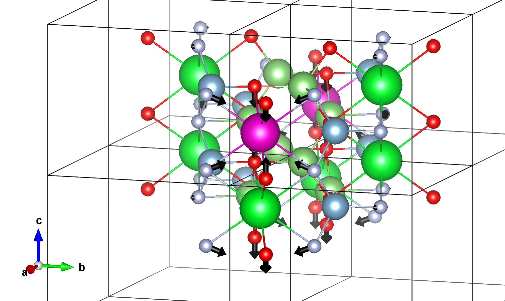

---
jupytext:
  text_representation:
    extension: .md
    format_name: myst
    format_version: 0.13
    jupytext_version: 1.10.3
kernelspec:
  display_name: Python 3
  language: python
  name: python3
---

$\newcommand{\AA}{\unicode{x212B}}$

# $\Delta$SCF Post-Processing (1D)

Now that the LumiWork is complete, it is time to analyze the results.
This first section shows how to do this with the so-called "single effective phonon mode model"
or "one-dimensional configuration coordinate model" (1D-CCM).
Recall that this model assumes the existence of a fictitious effective phonon mode
whose eigenvector exactly follows the atomic relaxation from the ground state to the excited state,
with an eigenfrequency computed with equation {eq}`omega_eff_g_e`.
For this analysis, we use the $\Delta$SCF calculations shown in the previous tutorial to instantiate a `DeltaSCF` object:

```{code-cell}
import warnings
warnings.filterwarnings('ignore')

from abipy.lumi.deltaSCF import DeltaSCF
scf_files=[
    "../workflows_data/flow_deltaSCF/w0/t2/outdata/out_GSR.nc",
    "../workflows_data/flow_deltaSCF/w0/t3/outdata/out_GSR.nc",
    "../workflows_data/flow_deltaSCF/w0/t4/outdata/out_GSR.nc",
    "../workflows_data/flow_deltaSCF/w0/t5/outdata/out_GSR.nc",
]

results = DeltaSCF.from_four_points_file(scf_files)

# or
#
# results = DeltaSCF.from_json_file("../workflows_data/flow_deltaSCF/w0/outdata/lumi.json")
#
# or only two relaxations
#
# results = DeltaSCF.from_relax_file(["../workflows_data/flow_deltaSCF/w0/t0/outdata/out_GSR.nc",
#                                     "../workflows_data/flow_deltaSCF/w0/t1/outdata/out_GSR.nc"])
```

```{note}
Energies are given in eV and distances in $\AA$.
```

## Total energies and electronic levels

The energies of the four relevant states are accessible with:

```{code-cell}
print(results.ag_energy, results.ag_star_energy, results.ae_star_energy, results.ae_energy)
```

If the electronic eigenenergies have been computed at a single $k$-point (typically $\Gamma$),
they can be plotted with (spin up in black, spin down in red):

```{code-cell}
results.plot_eigen_energies(scf_files);
```

In the ground state, notice the 7 Eu$_{4f}$ states located in the gap.
In the excited state (simulated with constrained occupations, as shown by the (un)filled markers),
the 4f hole lowers the energy of an occupied 5d state, which is now located at the top of the gap,
while the 6 remaining occupied 4f states are pushed down into the VB.
If you have computed the four band structures associated with each point, you can use `results.plot_four_BandStructures(nscf_files)`,
where `nscf_files` is the list of the four band structure .nc files.

```{code-cell}
nscf_files = [
    "../workflows_data/flow_deltaSCF/w0/t6/outdata/out_GSR.nc",
    "../workflows_data/flow_deltaSCF/w0/t7/outdata/out_GSR.nc",
    "../workflows_data/flow_deltaSCF/w0/t8/outdata/out_GSR.nc",
    "../workflows_data/flow_deltaSCF/w0/t9/outdata/out_GSR.nc",
]

results.plot_four_BandStructures(nscf_files);
```

Notice the strong dispersion of the bands close to the CB bottom, due to the interaction between the Eu$_{5d}$ replicas.
Increasing the supercell size reduces this dispersion.

## Atomic relaxation

The ground- and excited-state structures are accessible with:

```{code-cell}
results.structure_gs()
#results.structures_ex()
```

It is sometimes useful to decompose the gs-ex displacements by species:

```{code-cell}
results.get_dataframe_species()
```

or by atom:

```{code-cell}
results.get_dataframe_atoms(defect_symbol="Eu")
```

You can plot these displacements (or the ground-state forces at the excited-state atomic positions) as a function
of the distance from the defect.
This allows you to check the convergence of your calculation with respect to the supercell size.
In our toy example, the results are not converged: the displacements are underestimated because of
cancellation errors due to the periodic replicas of the defect.
Note that the forces decay faster with distance (this will be important in later tutorials).

```{code-cell}
results.plot_delta_R_distance(defect_symbol="Eu");
```

```{code-cell}
results.plot_delta_F_distance(defect_symbol="Eu");
```

To visualize these displacements on a VESTA structure, follow these steps:

(1) Create a CIF file with the ground-state structure.
(2) Open the structure with VESTA and save it in .vesta format (this must be done manually).
(3) Use the `draw_displacements_vesta()` method.

```{code-cell}
results.structure_gs().to(filename="gs_stru.cif")
# then open this cif with vesta, save it as .vesta file format
```

```{code-cell}
results.draw_displacements_vesta(in_path="gs_stru.vesta",color_vector=[0, 0, 0])
```

The resulting VESTA file should look like this:



You can modify how the vectors are drawn by changing the default arguments:

```{code-cell}
help(results.draw_displacements_vesta)
```

## Luminescent properties following the 1D-CCM

One can visualize the 1D-CCM and the associated displaced parabolas with

```{code-cell}
results.draw_displaced_parabolas();
```

or get a dataframe (or dictionary) with the main 1D-CCM parameters:

```{code-cell}
results.get_dataframe()
#results.get_dict_results()
```

Finally, one can plot the luminescence lineshape at 0 K:

```{code-cell}
results.plot_lineshape_1D_zero_temp(energy_range=[1,2]);
help(results.plot_lineshape_1D_zero_temp)
```
